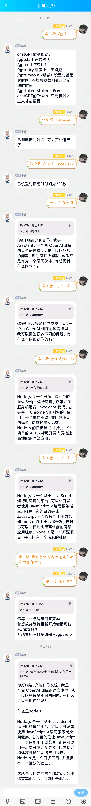
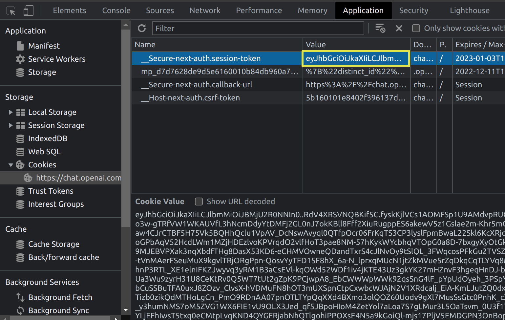

# ChatGPT-QQRobot
 基于go-cqhttp接口ChatGPT QQ机器人
## 使用说明
### 1. 安装go-cqhttp
详细安装方法请参考[go-cqhttp文档](https://docs.go-cqhttp.org/)
其中，go-cqhttp的配置文件config.yml的server部分需要配置http和ws（正向ws）两个通讯方式  
可参考如下配置（端口和ip可以根据需要自行修改）：
```yaml
servers:
  # 添加方式，同一连接方式可添加多个，具体配置说明请查看文档
  #- http: # http 通信
  #- ws:   # 正向 Websocket
  #- ws-reverse: # 反向 Websocket
  #- pprof: #性能分析服务器
  # HTTP 通信设置
  - http:
      # 服务端监听地址
      host: 0.0.0.0
      # 服务端监听端口
      port: 5700
      # 反向HTTP超时时间, 单位秒
      # 最小值为5，小于5将会忽略本项设置
      timeout: 5
      middlewares:
        <<: *default # 引用默认中间件
      # 反向HTTP POST地址列表
      post:
      #- url: '' # 地址
      #  secret: ''           # 密钥
      #- url: 127.0.0.1:5701 # 地址
      #  secret: ''          # 密钥
  # 正向WS设置
  - ws:
      # 正向WS服务器监听地址
      host: 0.0.0.0
      # 正向WS服务器监听端口
      port: 8080
      middlewares:
        <<: *default # 引用默认中间件
```
### 2. 克隆项目
```bash
git clone https://github.com/PairZhu/ChatGPT-QQRobot.git
```
### 3. 安装依赖
```bash
npm install
```
### 4. 修改配置文件
打开并修改.env文件，并将其中的参数修改为自己的参数，其中masterQQId为机器人主人的QQ号  
考虑到token可能会出现失效的情况，ChatGPT的SessionToken不在此处填写，而是在运行时随时可用命令配置（使用了lowdb持久保存，不用担心每次都要填写）  
项目中使用了lowdb不仅仅是为了保存token，也是为了将来增加更多功能的时候可能会用于保存会话栈和黑白名单等信息  
未来有精力了会考虑增加如下功能（开始画饼）：
1. 对话保存和恢复的功能：保持上一个对话的状态，可以打开下一个对话，类似于网页版同时打开多个页面，并且机器人关闭后也可以恢复上一次的对话状态
2. 任意对话点的回溯功能：使用QQ撤回消息的功能来实现交互，相当于电脑版网页面上的问题编辑功能
3. 管理员功能和黑白名单功能
### 5. 运行
```bash
npm start
```
### 6. 使用
机器人可以私聊和群聊使用，私聊时机器人会自动回复，群聊时需要@机器人才会回复（包括群里使用命令也要@机器人）  
命令列表可以向机器人发送/gpthelp来查看  
群聊里所有成员同处于一个对话中，私聊的时候每个人都有自己的对话，不同人不同群的对话是独立的互不干扰的。  
/gptretry命令的作用和网页版的Try again按钮一致，可以在不增加多余上下文的情况下让机器人重答一次之前的提问。  
在同一个对话中机器人一次只会回复一条消息，如果在机器人回复完上一条消息之前立即发送消息，机器人会丢弃这条消息并提示，但是可以使用除/gptretry以外的命令，机器人会立即执行这条命令并回复  
因为ChatGPT的响应速度不稳定，而且经常很慢，所以请耐心等待（默认的超时时间是100秒，可以使用命令修改）  
机器人需要配置了ChatGPT的token才能正常工作，可以使用命令/gpttoken来配置token，也可以直接在data/db.json中直接写入token。token的获取方式以及注册方式见最后一段。

下面是一些使用示例

## ChatGPT的注册以及token的获取方式（参考ikechan8370的教程）
1. 注册openai账号
进入https://chat.openai.com/ ，选择signup注册。目前openai不对包括俄罗斯、乌克兰、伊朗、中国等国家和地区提供服务，所以部分用户需要通过魔法上网的手段来使用其他国家和地区的ip登录，如果依然提示OpenAI's services are not available in your country. 则需要清空cookie等网页缓存并且退出浏览器的用户账号刷新后重试。  
此外，注册需要验证所在国家和地区的手机号码（似乎不支持虚拟手机号），如果没有国外手机号可以试试解码网站，收费的推荐https://sms-activate.org/。
2. 获取token
注册并登录后进入https://chat.openai.com/chat ，打开浏览器检查界面（按F12），找到图中所示的token值完整复制即可。


其他问题可以参考使用的api库https://github.com/transitive-bullshit/chatgpt-api

## 感谢
* https://docs.go-cqhttp.org/
* https://github.com/transitive-bullshit/chatgpt-api
* https://chat.openai.com/
